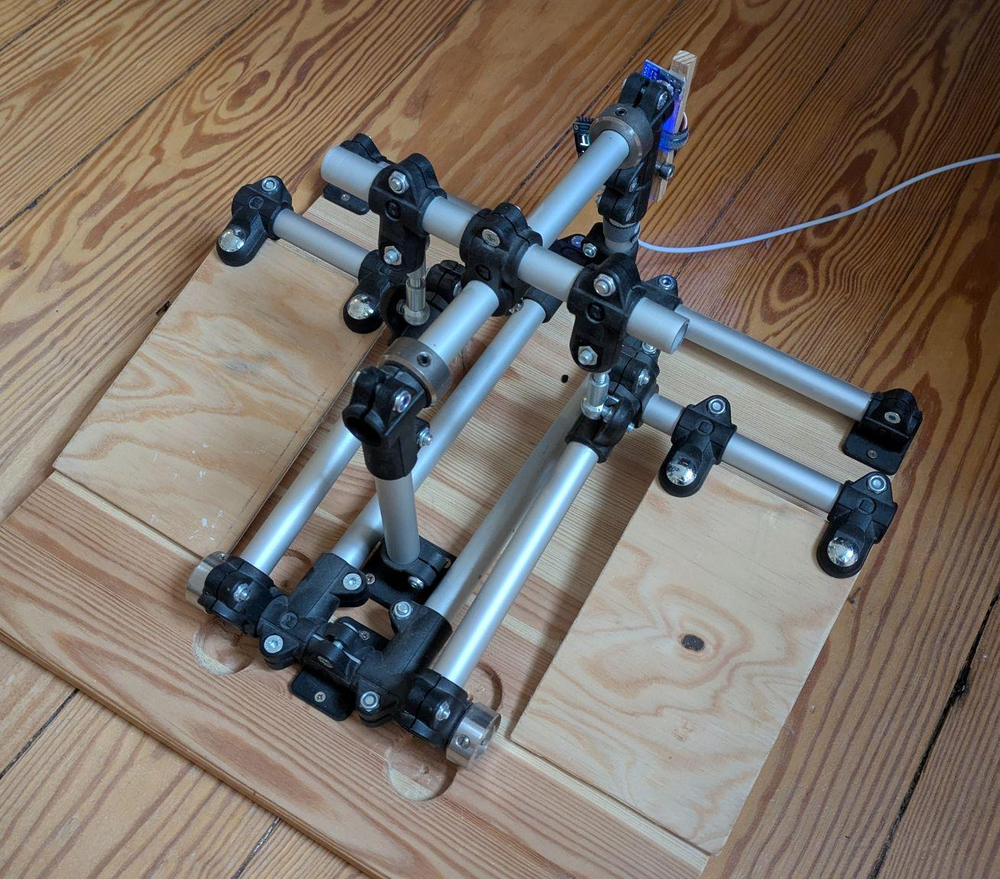

# DIY pedals for flight simulators

The project consists of three things:
1. a mechanical design of pedals, only using standard parts,
3. electronics for measuring stick sensors and acting as an USB game controller.

BOM and pictures soon.

# Pedals 

A mostly tool-less construction. Aluminium pipes connected with a module connector system.

# Current Electronics (ESP32 as Joystick via Bluetooth BLE) in esp32_ble_stick/

BOM:
* Waveshare RP2040 Zero board, running CircuitPython
* SSD 1306 display
* CJMCU-103 Rotary Angle Sensor Modul Murata SV01A
